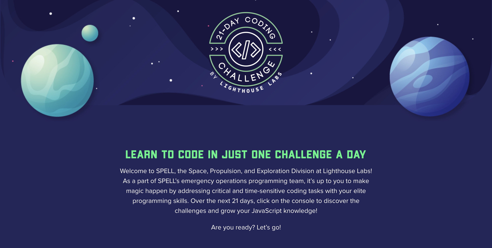

# LHL's 21-Day Coding Challenge

From Nov 22 to Dec 12, 2021, I participated in this coding challenge as a way to test my Javascipt skills to see if I can solve simple problems on my own. I was in the process of completing my web dev bootcamp (also from LHL), so it was also a good way for me to practice my coding skills after bootcamp ended. 

Thanks to some suggestions, I decided to create a repo of my solutions to the 21 challenges to remind myself how far I have progressed over the past few months and something to look back on as I continue this journey.

See you next year #21DCC! 